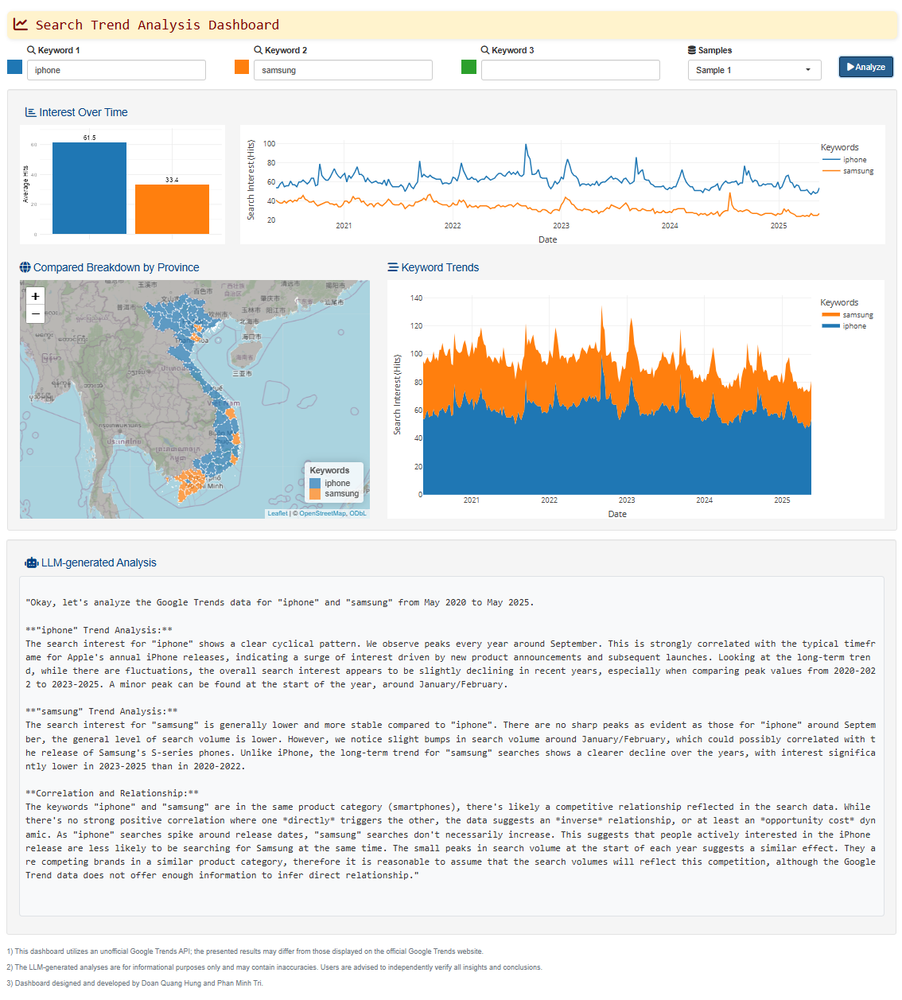

# 📌 **Project Proposal | Search Trend Analysis Dashboard**

**Designed and Developed by Doan Quang Hung and Phan Minh Tri**

---

## **Introduction**

### **Overview**

With the rapid advancement of Large Language Models (LLMs) and the essential role that search engines play in our daily lives, search trends from specific countries, such as Vietnam, offer valuable insights that can benefit a variety of stakeholders. These insights can inform decision-makers, businesses, researchers, and the general public about current trends and hot topics. To provide a deeper understanding of these trends, we propose the development of an interactive dashboard that leverages the Google Trends API to compare the popularity of different keywords over time. 

This tool will enable users to explore how search interest for selected keywords evolves, providing insights into public interest trends. By incorporating LLMs, we aim to offer **real-time analysis** that presents relevant, actionable data, which is crucial for both businesses and researchers.

### **Research Question**

The central question of our research is:  
**How do search trends for different keywords compare in terms of popularity over time, and by region in Vietnam?**

This investigation will help uncover the relative public interest in each keyword, how this interest fluctuates over time, and how it is distributed across various regions of Vietnam. Understanding these dynamics can provide critical insights into the social and cultural factors influencing public interest.

---

## **Project Details**

### **Motivation**

Our primary motivation behind creating this tool is to build a practical, user-friendly dashboard that can provide immediate, meaningful insights into trending keywords. We want this tool to be accessible to individuals, even those without a technical background, to help them quickly grasp public interest in various topics. This dashboard will not only present trends over time but also break down data by subregions, offering localized insights. Additionally, it will explore correlations between keywords, making it easier to draw conclusions and identify patterns.

The following are some applications:
- **Business and Marketing**: Companies can use the tool to gauge the popularity of their products, services, or brands, and adjust their strategies accordingly.
- **Public Interest**: Researchers and policymakers can track the evolution of public interest in various topics over time, helping them better understand societal shifts.
- **Forecasting**: By analyzing historical trends, this tool can assist in forecasting the future popularity of specific keywords or topics.

This tool will be particularly beneficial for individuals who are not familiar with data analysis tools like Google Trends or advanced artificial intelligence tools (such as ChatGPT or Gemini), enabling them to easily analyze trends and gain insights without requiring any technical knowledge.

## **Dashboard**
